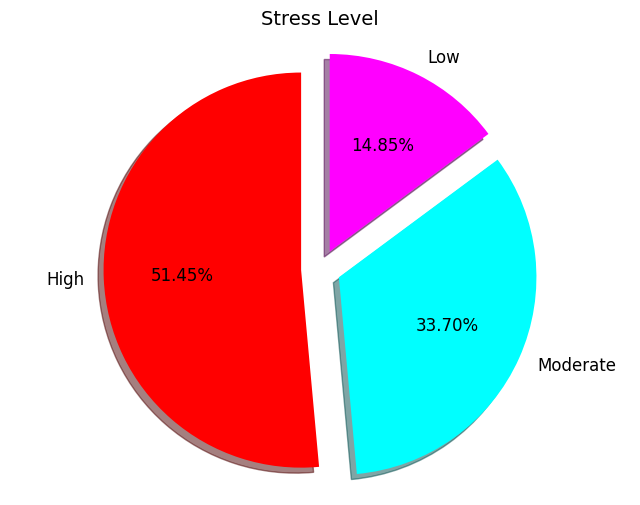
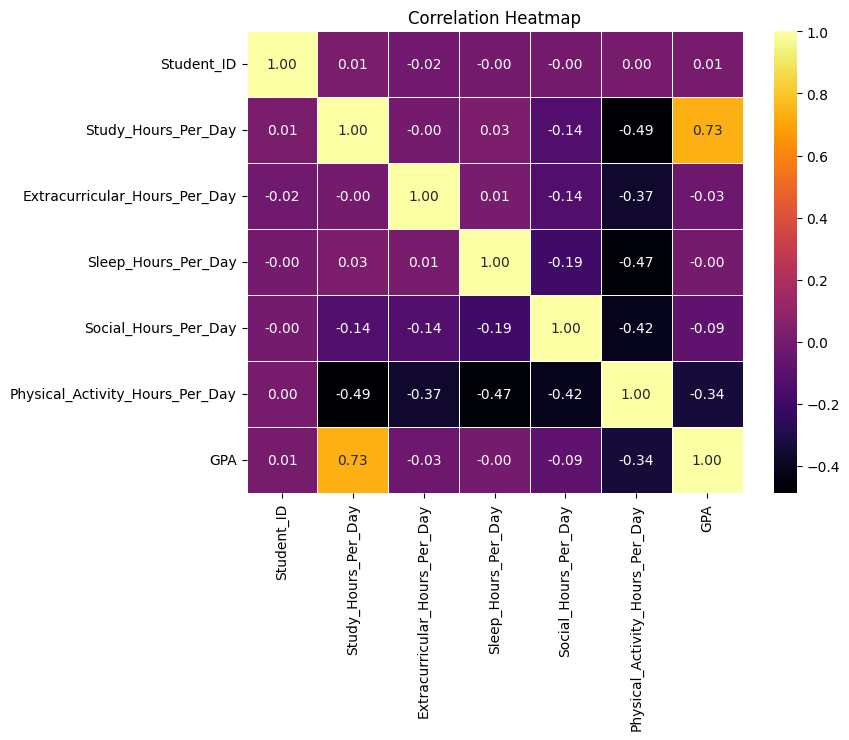
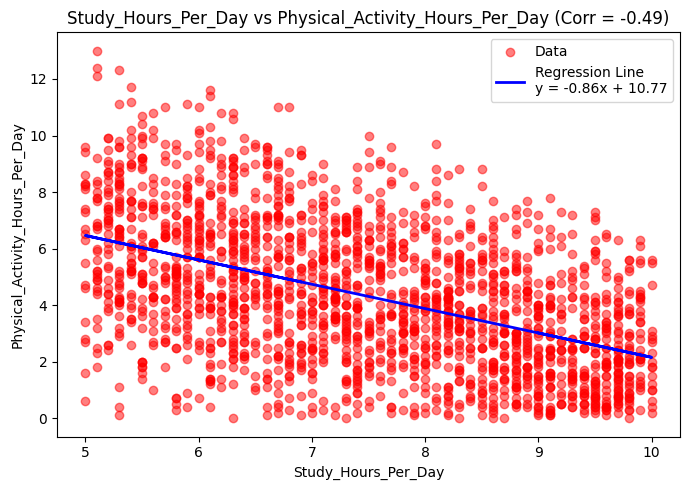
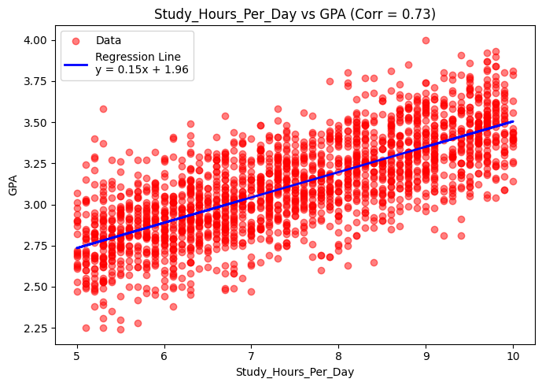
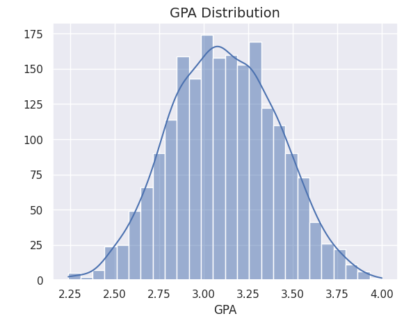
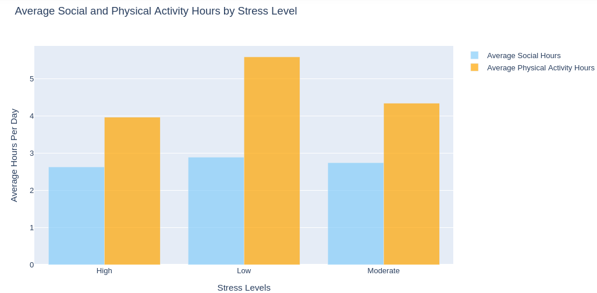
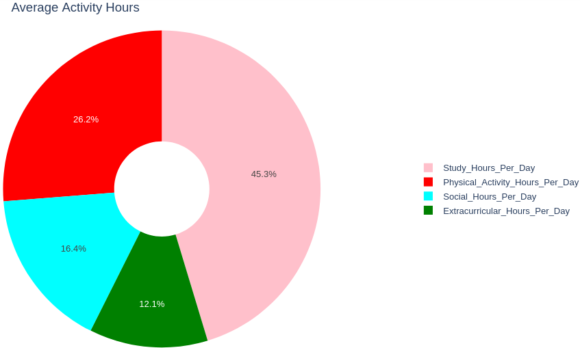

# 📊 Student Wellness & Academic Performance

This project explores how students' daily habits relate to their academic performance and stress levels. It combines exploratory data analysis and simple machine learning techniques using a synthetic dataset of **2,000 students**.

---

## 📁 Dataset Overview

Each student record contains the following columns:

| Column | Description |
|--------|-------------|
| `Student_ID` | Unique identifier for each student |
| `Study_Hours_Per_Day` | Hours spent studying daily |
| `Extracurricular_Hours_Per_Day` | Time spent on extracurriculars daily |
| `Sleep_Hours_Per_Day` | Daily sleep duration |
| `Social_Hours_Per_Day` | Time spent socializing |
| `Physical_Activity_Hours_Per_Day` | Time spent in physical activity |
| `GPA` | Academic performance |
| `Stress_Level` | Categorical: Low, Moderate, High |

---

## 📈 Visualizations & Insights

### 🎯 Stress Level Distribution

> Majority of students fall into the high stress category.

---

### 🔥 Correlation Heatmap

This heatmap shows the pairwise correlation between key student metrics. Features with an **absolute correlation above 0.4** (|r| > 0.4) were **selected for regression analysis**, as they suggest a potentially meaningful linear relationship.

- For example:
  - `Study_Hours_Per_Day` and `GPA` → **Strong positive correlation (r = 0.73)**
  - `Study_Hours_Per_Day` and `Physical_Activity_Hours_Per_Day` → **Moderate negative correlation (r = –0.49)**

---

### 📉 Regression: Study Hours vs Physical Activity

> Students who study more tend to exercise less — possibly due to time trade-offs.

---

### 📈 Regression: Study Hours vs GPA

> More study time generally leads to a higher GPA, as shown by the clear upward trend.

---

### 📊 GPA Distribution

> GPA follows a nearly normal distribution centered around 3.0, indicating a realistic academic spread.

---

### 📊 Social & Physical Activity by Stress Level

> Students with **lower stress** tend to spend **more time socializing and being physically active**. This may reflect better time management or overall well-being.

---

### 🍩 Average Time Breakdown by Activity

This **donut pie chart** summarizes how students divide their time across key activities. Most time is spent on:

- 📚 **Studying** — the largest slice
- 🏃‍♂️ **Physical Activity**
- 👥 **Socializing**
- 🏆 **Extracurriculars**

This breakdown helps visualize how daily priorities shift among the student population and complements the correlation and stress-level insights.

---

## 💡 Key Takeaways

- 📚 **Study hours are positively correlated with GPA** (+0.73)
- 🏃‍♂️ **Physical activity is negatively correlated with study hours** (–0.49)
- 🤯 **High stress levels** are associated with **less social/physical time**
- ⚖️ Balance is key — too much study time may reduce physical well-being

---

## 🛠️ Tech Stack

- Python: `pandas`, `matplotlib`, `seaborn`, `plotly`, `scikit-learn`
- Jupyter Notebook
- GitHub

---

## 📂 Folder Structure

